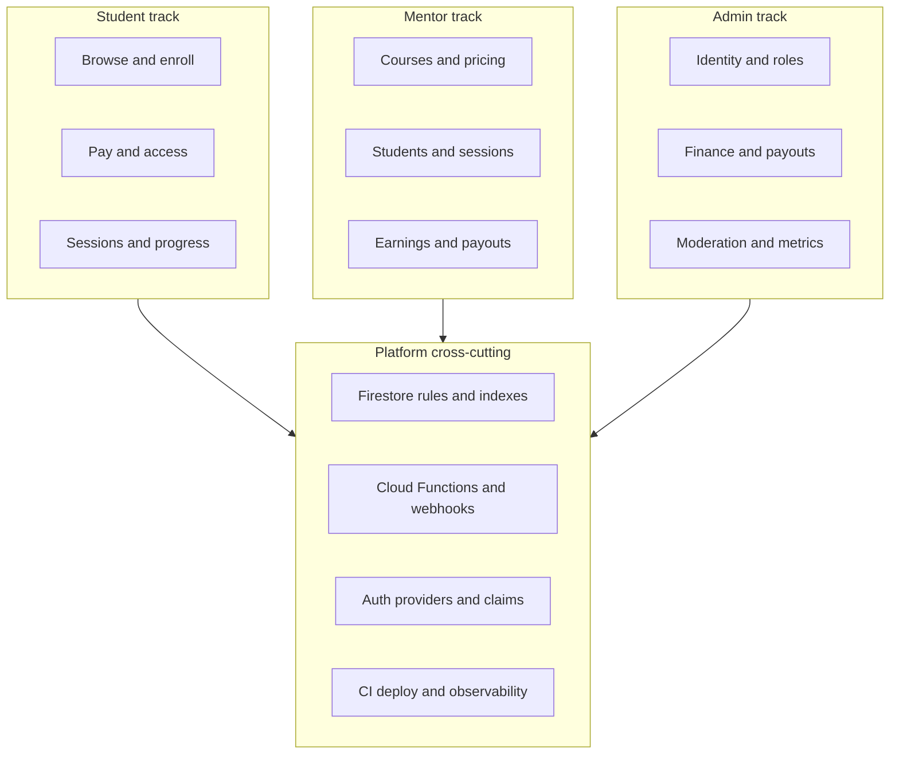

# MentorFlow — project plan

## 1. Product summary

MentorFlow is a multi-role edtech-style platform (student, mentor, admin) built with **Vite + React + TypeScript**, **Tailwind**, and **Firebase (Auth + Firestore)**. The app already exposes dashboards, catalog, KYC, messaging, payouts, and admin tooling; several **core money and marketplace loops** still need to be implemented or connected end-to-end.

This plan is organized by **role responsibilities** and **cross-cutting technical work**, so mentor and admin scope stay explicit.

---

## 2. Roles and responsibilities

### 2.1 Student

- Discover courses and mentors, enroll (or request enrollment), pay, access materials / sessions.
- Complete onboarding and KYC when required for paid or premium access.
- Message assigned mentors; receive notifications (payments, sessions, messages).

### 2.2 Mentor

- Maintain profile and **KYC / payout identity** (bank details, verification state).
- **Create and manage courses** (title, description, price, commission rate aligned with platform policy).
- See **students tied to enrollments**, earnings / commissions, and **request payouts**.
- **Schedule and run sessions** (or mark complete); message students.
- Operate within rules: only own courses, own payout requests, own mentor-side enrollment reads/updates where rules allow.

### 2.3 Admin

- **Platform oversight**: metrics, user base health, course catalog quality (if moderation is in scope).
- **User and mentor operations**: invite or manage mentor records, suspend or correct roles (via secure mechanism, not client-only trust).
- **Financial operations**: reconcile **payments**, **approve/process payouts**, handle disputes; ideally all sensitive writes go through **trusted backend** (e.g. Cloud Functions) after payment-provider webhooks.
- **Compliance**: KYC review workflow (approve/reject with reason), audit-friendly actions.
- **Security posture**: admin identity via **custom claims** (or equivalent), not hard-coded emails in client or rules long-term.

---

## 3. Current technical baseline (repo)

| Area | Location |
|------|----------|
| Entry / tab routing | `src/App.tsx` |
| Auth & profiles | `src/context/AuthContext.tsx`, `src/components/auth/Login.tsx` |
| Firestore reads | `src/hooks/useFirestore.ts` |
| Security rules | `firestore.rules` |
| Firebase client | `src/lib/firebase.ts`, `firebase-applet-config.json` |
| UI components | `components/ui/`, `src/components/ui/textarea.tsx` |
| Path aliases | `vite.config.ts`, `tsconfig.json` |

**Important gap:** course creation uses `addDoc` in `src/components/courses/CoursesView.tsx` while `isValidCourse` in `firestore.rules` expects an `id` field on the document — align client payload and rules (or set `id` to the Firestore document id) so mentors/admins can create courses reliably.

**Important gap:** **enrollments** and **sessions** are read in dashboards (`StudentDashboard`, `MentorDashboard`, `AdminDashboard`, etc.) but there is no full **create/update** UI path for the student–mentor lifecycle across the app.

---

## 4. Planning structure

Work proceeds in **parallel tracks** (Student / Mentor / Admin) with **integration milestones** (shared schema, rules, Functions, deploy).

---

## 5. Phased delivery

### Phase 0 — Hygiene and unblockers

- Fix **course create** vs **Firestore rules** (`id` / `addDoc` mismatch).
- Keep **UI import paths** coherent (`@/components/ui` mapping to root `components/ui` plus textarea override).
- Document Firebase Console setup: Auth providers, authorized domains, Firestore database ID.

**Owners:** engineering (all roles benefit).

---

### Phase 1 — Auth, identity, and admin foundation

**Student / mentor**

- Optional second auth method (e.g. email/password) if Google-only is a business constraint.
- Clear error UX on sign-in failure.

**Admin**

- Move from **hard-coded admin email** (client + rules) to **custom claims** (or a vetted admin list maintained only server-side) and update `firestore.rules` checks accordingly.
- Define who may change `role` and under what audit trail.

**Mentor**

- No change to “mentor is a role” beyond safer global admin model.

**Deliverable:** Admins are provable in rules; no secret back door in client-only checks.

---

### Phase 2 — Mentor: catalog and students

**Mentor**

- Reliable **course CRUD** (create, edit, archive) with correct `mentorId` and commission fields.
- View **students** linked to their enrollments (once enrollments exist).

**Admin**

- Optional: approve courses, edit any course, or assign mentors to institutional programs (product decision).
- Extend `MentorsView` workflows (verify, deactivate) backed by rules.

**Student**

- Browse catalog; see mentor on course card.

**Deliverable:** Courses are authoritative in Firestore; mentors manage their own catalog within policy.

---

### Phase 3 — Student: enrollment and access

**Student**

- Enrollment flow (purchase, apply, or admin-assigned — pick one product model).
- Post-enrollment UI: “my courses,” progress placeholder if needed.

**Mentor**

- See new enrollments for their courses; update allowed enrollment fields per rules (e.g. status).

**Admin**

- Override or create enrollments for support; reporting on enrollments.

**Deliverable:** `enrollments` collection populated by real flows, not only dashboards reading empty data.

---

### Phase 4 — Money: payments, commissions, payouts

**Student**

- Pay via regional provider (e.g. Paystack / Flutterwave for NGN) with clear receipts.

**Mentor**

- Accurate **commission** display; **payout request** flow tied to verified KYC and minimums (product rules).
- Dedicated **commissions** view (replace reuse of `MentorDashboard` for the `commissions` tab in `App.tsx` if still a shortcut).

**Admin**

- Webhook-verified **payment** recording; dispute handling entry points.
- **Payout processing** UI wired to immutable state transitions (`pending` → `processed` / `failed`).

**Platform**

- **Cloud Functions** (or small backend): verify payment webhooks, write `payments`, update `enrollments` (`totalPaid`, `commissionEarned`) atomically; never trust client-only “payment succeeded.”

**Deliverable:** Money path is auditable; mentor and admin each have the right read/write surface.

---

### Phase 5 — Sessions and delivery

**Mentor**

- Create/update **sessions** (scheduled, completed, cancelled) for enrolled students.

**Student**

- `StudentDashboard` already expects sessions — wire scheduling and display.

**Admin**

- Optional oversight: all sessions, cancellation on dispute.

**Deliverable:** `sessions` collection populated; student and mentor calendars reflect reality.

---

### Phase 6 — Messaging and notifications

**Mentor / student**

- **Create chat** UX (chats only appear if documents already exist): start conversation from mentor list or course context; prevent duplicate threads if required.

**Admin**

- Decide if admins participate in chats or only see escalations.

**Platform**

- Tighten `notifications` **create** rule (currently broad); prefer **server-created** notifications on domain events (payment, session, message).

**Deliverable:** Reliable comms; less spam/abuse risk.

---

### Phase 7 — Production readiness

- Firestore **indexes** for every query (filters + orderBy).
- **Pagination** for large lists (`users`, messages).
- **CI:** `npm run lint`, `npm run build`; staged **rules** deploy.
- **Hosting** (Firebase Hosting or existing pipeline).
- **Legal:** Terms / Privacy / KYC retention aligned with copy on the login screen.

**Owners:** engineering + ops; **admin** is the primary consumer of ops/metrics views.

---

## 6. Milestone checklist (role-aware)

| Milestone | Student | Mentor | Admin | Platform |
|-----------|---------|--------|-------|----------|
| M1 | Can sign in | Can create course (rules fixed) | Secure admin identity | Rules + indexes |
| M2 | Can enroll | Sees enrollments | Can support / override enrollments | Transactions as needed |
| M3 | Can pay | Sees commission / requests payout | Processes payouts | Webhooks + Functions |
| M4 | Sessions visible | Manages sessions | Optional oversight | Notifications from events |
| M5 | Messages mentors | Messages students | Policy set | Chat create + notification rules |
| M6 | — | — | Runs business on dashboards | Deploy + compliance |

---

## 7. Out of scope unless requested

- Native mobile apps.
- Full video conferencing product (can start with external links).
- Full CRM beyond what Firestore + admin UI already suggest.

---

## 8. Open product decisions (capture early)

1. Enrollment model: instant pay vs application vs admin assignment.
2. KYC: required before first payment, before payout only, or both.
3. Admin powers: course moderation vs mentor-only catalog.
4. Single commission rate (e.g. 37%) vs per-course override caps.

---

*Align dates, owners, and estimates with your team.*
